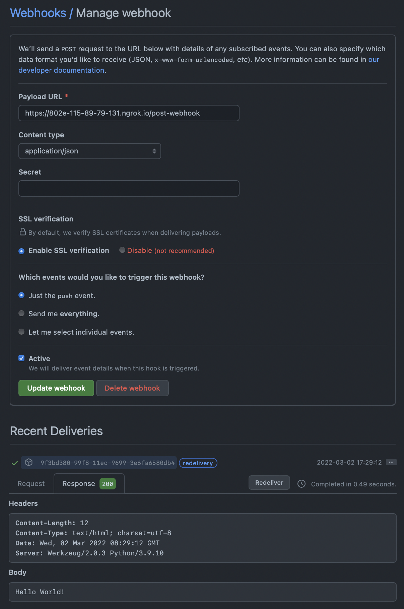

# Leveraging GitHub Webhooks

You can setup webhooks for your GitHub repository. You can create various automation tools when there's a change in the repository. This repository uses `Flask` and `flask-ngrok` to quickly test GitHub Webhooks. `Flask` is a minimal web framework for Python and `flask-ngrok` is a tool to expose your localhost `Flask` web server to the internet by leveraging `ngrok`. For more information about these tools check out the following links.

- [`Flask`](https://flask.palletsprojects.com/en/2.0.x/)
- [`ngrok`](https://ngrok.com/docs)
- [`flask-ngrok`](https://github.com/gstaff/flask-ngrok)


***STEP 1***

Fork this repository and clone it on your local machine. After installing the `requirements.txt` with `pip` and activating the environment, run the server with `python run.py`.


***STEP 2***

If it is your first time using `ngrok`, follow the documentation instructions. Sign up and install the `authtoken` in your local environment.

***STEP 3***

Restart the web server with `python run.py` and copy the `https://******.ngrok.io` URL which points to the localhost. From GitHub, go to the forked repository(`Settings > Webhooks`) and `Add webhook`. 

***STEP 4***

Since the route that accepts the `POST` request is `/post-webhook`, input the Payload URL the following way.

```txt
https://*********.ngrok.io/post-webhook
```

***STEP 5***

Press `Update webhook` and check the response in Recent Deliveries.


